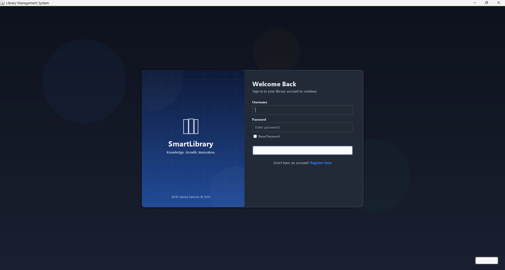
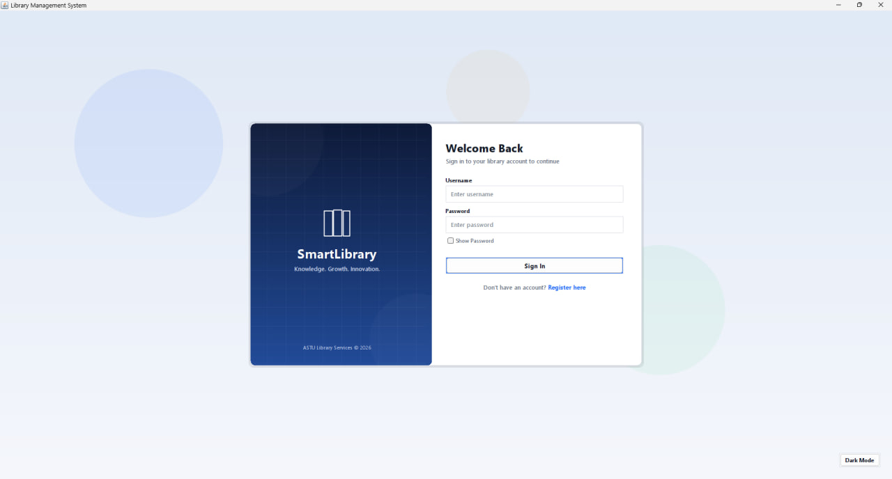
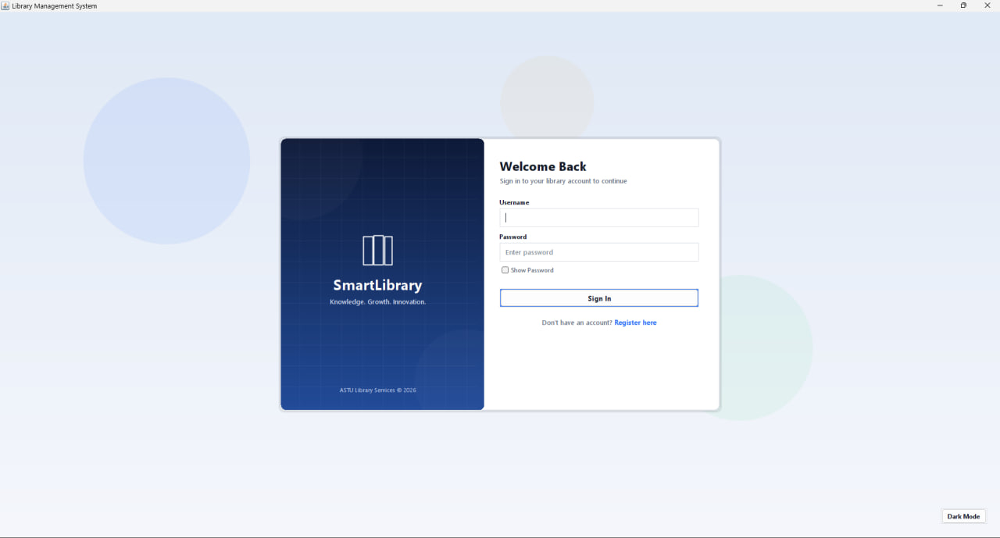
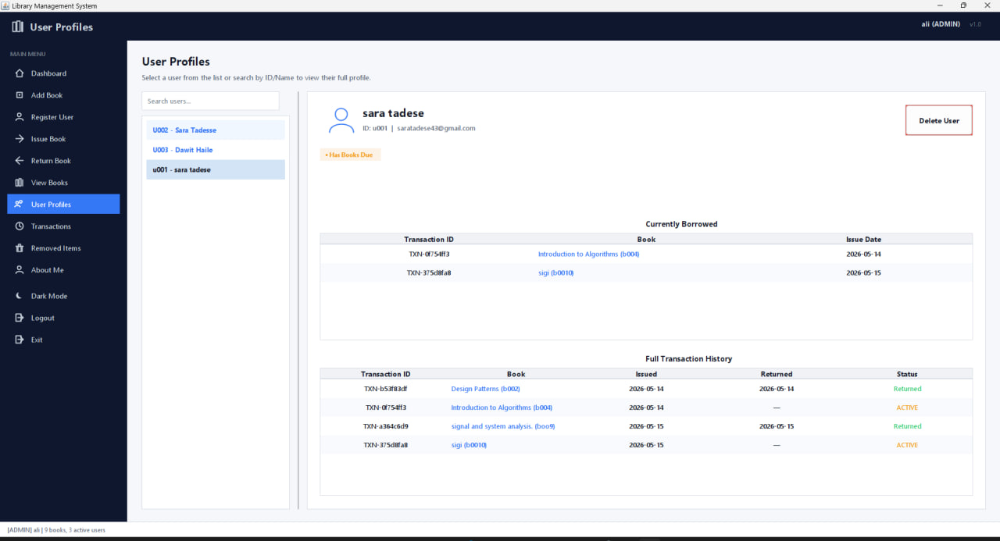
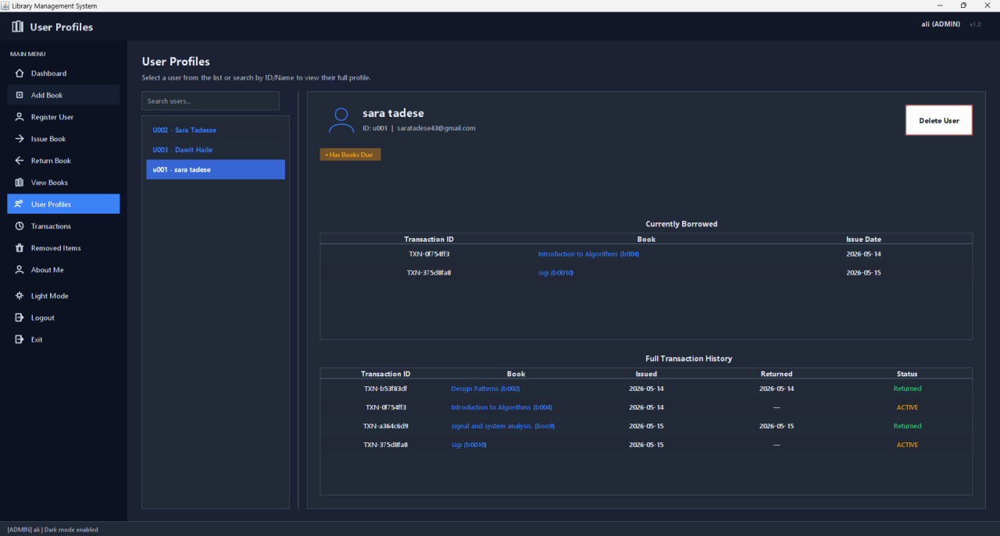
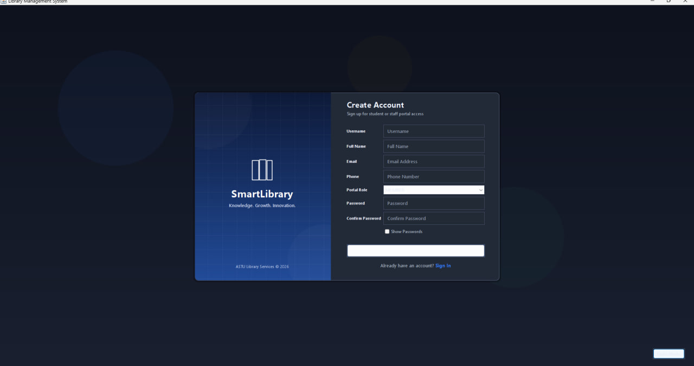

# 📚 SmartLibrary - Library Management System

[](https://www.oracle.com/java/)
[](#)
[](LICENSE)
[](#)
[](#)

SmartLibrary is a professional, high-performance desktop **Library Management System** engineered with pure Java and modern Swing. It features an offline-first architecture using lightweight CSV persistence, eliminating the need for heavy database server installations.

Equipped with role-based access control, cryptographic password security, and a beautiful responsive interface supporting dynamic light/dark mode themes, SmartLibrary is ready for deployment in small to medium libraries, schools, or private collections.

---

## 📋 Table of Contents
- [User Interface Screenshots](#-user-interface-screenshots)
- [Key Features](#-key-features)
- [Project Structure](#-project-structure)
- [Getting Started for Developers](#-getting-started-for-developers)
- [Creating Release Packages](#-creating-release-packages)
- [Local Storage Architecture](#-local-storage-architecture)
- [License & Versioning](#-license--versioning)

---

## 🖥️ User Interface Screenshots

To give you an idea of the polished user experience, here is a preview of the SmartLibrary interface across light and dark themes:

### 🔐 Authentication Portal
| Light Mode | Dark Mode |
| :---: | :---: |
|  |  |
| *Clean, focused credentials input with validation feedback.* | *Beautiful dark-themed workspace layout to reduce eye strain.* |

> [!NOTE]
> Below is an alternative view of the login window demonstrating responsive form elements and professional layouts.
> 

### 👥 User Profiles & Membership Management
| Light Mode View | Dark Mode View |
| :---: | :---: |
|  |  |
| *Role and permission grids with light aesthetic accents.* | *Professional layout with custom high-contrast dark accents.* |

### 📝 Member Registration Panel
Below is the registration workflow interface, showing real-time password strength validation and role assignment:
<p align="center">
  
</p>

---

## ✨ Key Features

- **Role-Based Access Control (RBAC):** Tailored privileges for **Admin**, **Librarian**, and **Member** roles.
- **Cryptographic Security:** Multi-layered security using SHA-256 password hashing and secure authorization tokens.
- **Modern Adaptive Theme Engine:** Seamless runtime switching between Light Mode and Dark Mode.
- **High-Performance CSV Database:** Low-latency file persistence with automatic seeding, data integrity validation, and zero server maintenance.
- **Native OS Integration:** Packaged as a native `.exe` with a trimmed Java runtime (JRE 17) for zero-setup execution.
- **Robust Transaction Log:** Complete history tracking for checkouts, returns, and inventory modifications.

---

## 📂 Project Structure

```text
SmartLibrary/
├── src/main/java/library/
│   ├── auth/                 # Authentication, authorization, and hashing
│   ├── config/               # Application metadata, version settings, and environment paths
│   ├── exception/            # Custom application error classes
│   ├── gui/                  # Front-end components
│   │   ├── auth/             # Login and Registration dialog windows
│   │   ├── dashboard/        # Main application dashboard layout
│   │   ├── controller/       # Event handlers bridging UI and Services
│   │   ├── dialogs/          # Modal prompts (Add/Edit book, etc.)
│   │   ├── components/       # Custom-styled tables, inputs, and buttons
│   │   └── util/             # Look & Feel theme managers and UI helpers
│   ├── io/                   # High-performance CSV file access layer
│   ├── main/                 # Core program entry point
│   ├── model/                # Data transfer objects (Book, User, Transaction)
│   ├── service/              # Core business logic layer
│   └── util/                 # General-purpose utility helpers
├── src/main/resources/       # Non-code assets
│   ├── icons/                # System application icons
│   ├── themes/               # Theme definition files
│   ├── templates/            # Default empty CSV tables to seed on first run
│   └── application.properties# System configuration properties
├── screenshots/              # UI screenshots
├── scripts/                  # Build & launch automation files
├── data/                     # Local development CSV storage (gitignored)
├── build/                    # Generated build cache (gitignored)
└── dist/                     # Binary releases (gitignored)
```

---

## 🚀 Getting Started for Developers

### System Requirements
* **Java Development Kit (JDK):** Version 17 or higher
* **Path Setup:** Ensure `javac`, `jar`, and `jpackage` tools are accessible on your system PATH.

### 1. Run in Development Mode
Launch the application instantly using the preloaded development script:
```cmd
run-dev.bat
```
*This command runs the code directly from sources using the local `./data/` folder directory as its database.*

### 2. Default Credentials
Use the factory admin account for initial setup:
* **Username:** `admin`
* **Password:** `admin`
*(You will be requested to update the admin credentials upon your first login for security reasons.)*

---

## 📦 Creating Release Packages

To build production-ready, native Windows binaries (independent of any system-wide Java installation), run:

```cmd
build.bat
```

The script will compile the code, bundle resources, shrink a custom JRE, and generate the following output artifacts under `dist/`:

| Build Output | Target Use Case | Setup Prerequisites |
|---|---|---|
| `dist/SmartLibrary-1.0.0-win64.zip` | **Portable release** (extract & run) | None (standard build) |
| `dist/SmartLibrary-Setup.exe` | **Native Windows installer** | [WiX Toolset v3.x+](https://wixtoolset.org/) installed |

---

## 💾 Local Storage Architecture

Depending on how SmartLibrary is executed, it routes database storage safely to prevent data loss:

| Run Mode | Storage Folder Path | Purpose |
|---|---|---|
| **Development** | `[Project Root]/data/` | Isolated local test database (changes gitignored) |
| **Installed App** | `%APPDATA%\SmartLibrary\data\` | Persistent production database per user |

For instructions on backup workflows, recovery, security hardening, and deployment guidelines, refer to the [Deployment Guide (DEPLOYMENT.md)](DEPLOYMENT.md).

---

## 📄 License & Versioning
- Version: **1.0.0**
- License: **Apache License 2.0** — See the [LICENSE](LICENSE) file for details.
- Changelog: Check history & updates in the [CHANGELOG.md](CHANGELOG.md).
